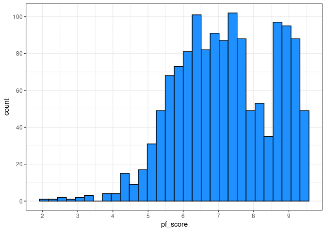
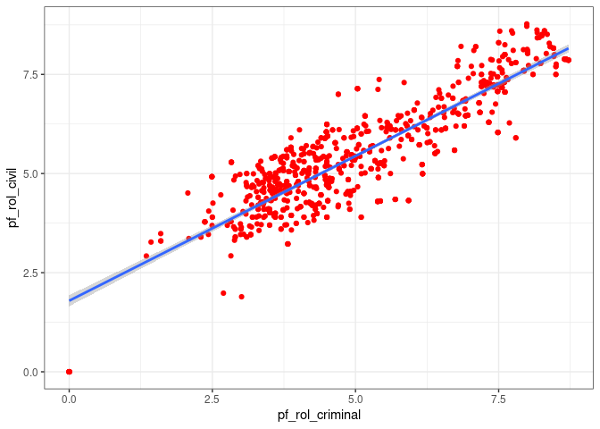
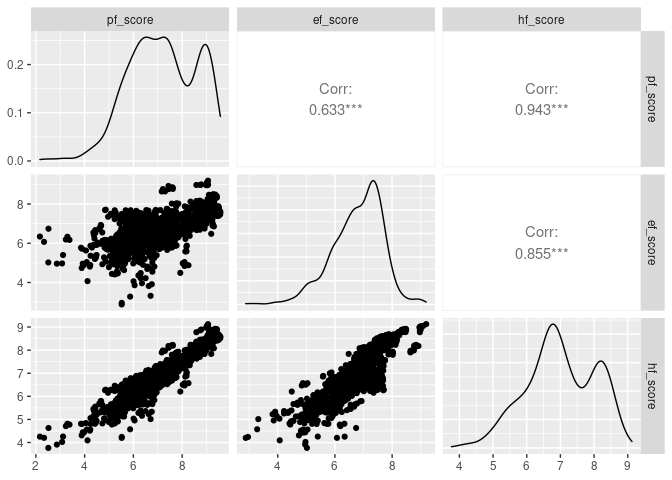

Activity 2 - Day 1
================

## Task2 : Loading the necessary packages

``` r
suppressPackageStartupMessages(library(tidyverse))
suppressPackageStartupMessages(library(tidymodels))
suppressPackageStartupMessages(library(GGally))
```

## Task3 : Loading the data

``` r
hfi<-readr::read_csv("https://www.openintro.org/data/csv/hfi.csv",show_col_types = FALSE)
```

1.  This is an observational study as it was not using or conducting any
    experiment to produce the reports.

## Plot to visualize the distribution of pf\_score

``` r
plot1 <- hfi %>% ggplot(aes(x=pf_score))+
  geom_histogram(fill="dodgerblue",color="black")+
  scale_x_continuous(breaks = c(1,2,3,4,5,6,7,8,9,10))+
  scale_y_continuous(breaks = c(0,20,40,60,80,100))+
  theme_bw()

plot1
```

    ## `stat_bin()` using `bins = 30`. Pick better value with `binwidth`.

    ## Warning: Removed 80 rows containing non-finite values (stat_bin).

<!-- -->

2.  The univariate histogram for pf\_score is left\_skewed with extreme
    outliers on the left (very low pf\_scores) and multiple peaks. I
    expected that a lot of countries will be having low pf\_scores but
    surprisingly it was the opposite.

3.  I have decided to describe the relation between pf\_rol\_civil and
    pf\_rol\_criminal which looks Linear relationship for me and
    displayed below with the help of a scatter plot and linear
    regression line.

``` r
plot2<- hfi %>% ggplot(aes(x=pf_rol_criminal,y=pf_rol_civil))+
  geom_point(color="red")+
  geom_smooth(method = lm)+
  theme_bw()

plot2
```

    ## `geom_smooth()` using formula 'y ~ x'

    ## Warning: Removed 578 rows containing non-finite values (stat_smooth).

    ## Warning: Removed 578 rows containing missing values (geom_point).

<!-- -->

# Task4 : Pairwise relationships

``` r
hfi %>% 
  select(ends_with("_score")) %>% 
  ggpairs()
```

<!-- -->

4.  -   hf\_score and pf\_score - strong Linear relationship
    -   hf\_score and ef\_score - moderate Linear relationship
    -   pf\_score and ef\_score - no relationship (nuetral)

5.  -   hf\_score and pf\_score are highly correlated with
        correlation-coefficient of 0.943
    -   hf\_score and ef\_score are highly correlated with
        correlation-coefficient of 0.855
    -   ef\_score and pf\_score are moderately correlated with
        correlation-coefficient of 0.633

## Task5 : The Multiple Linear Regression Model

``` r
m_hr_ef <- lm(pf_score ~ hf_score + ef_score, data = hfi)
tidy(m_hr_ef)
```

    ## # A tibble: 3 × 5
    ##   term         estimate std.error statistic p.value
    ##   <chr>           <dbl>     <dbl>     <dbl>   <dbl>
    ## 1 (Intercept)  1.46e-11  1.50e-10  9.78e- 2   0.922
    ## 2 hf_score     2.00e+ 0  3.63e-11  5.52e+10   0    
    ## 3 ef_score    -1.00e+ 0  4.21e-11 -2.38e+10   0

6.  The estimated equation for this model is

$$
\texttt{pf_score} = (1.464213e-11) + (2.000000e+00) \times \texttt{hf_score} + (-1.000000e+00) \times \texttt{ef_score} + \varepsilon
$$

**I am done for the day**
