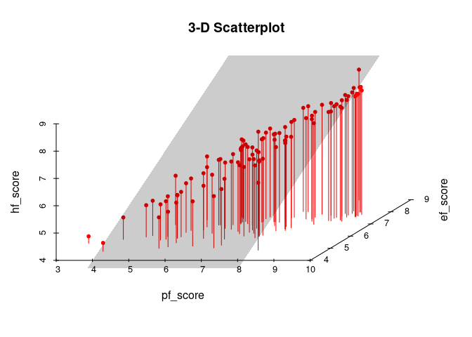

Activity 2 - Day 1
================

## Task2 : Loading the necessary packages

``` r
suppressPackageStartupMessages(library(tidyverse))
suppressPackageStartupMessages(library(tidymodels))
suppressPackageStartupMessages(library(GGally))
suppressPackageStartupMessages(library(scatterplot3d))
```

## Task3 : Loading the data

``` r
hfi<-readr::read_csv("https://www.openintro.org/data/csv/hfi.csv",show_col_types = FALSE)
```

1.  This is an observational study as it was not using or conducting any
    experiment to produce the reports.

## Plot to visualize the distribution of pf\_score

``` r
plot1 <- hfi %>% ggplot(aes(x=pf_score))+
  geom_histogram(fill="dodgerblue",color="black")+
  scale_x_continuous(breaks = c(1,2,3,4,5,6,7,8,9,10))+
  scale_y_continuous(breaks = c(0,20,40,60,80,100))+
  theme_bw()

plot1
```

    ## `stat_bin()` using `bins = 30`. Pick better value with `binwidth`.

    ## Warning: Removed 80 rows containing non-finite values (stat_bin).

<!-- -->

2.  The univariate histogram for pf\_score is left\_skewed with extreme
    outliers on the left (very low pf\_scores) and multiple peaks. I
    expected that a lot of countries will be having low pf\_scores but
    surprisingly it was the opposite.

3.  I have decided to describe the relation between pf\_rol\_civil and
    pf\_rol\_criminal which looks Linear relationship for me and
    displayed below with the help of a scatter plot and linear
    regression line.

``` r
plot2<- hfi %>% ggplot(aes(x=pf_rol_criminal,y=pf_rol_civil))+
  geom_point(color="red")+
  geom_smooth(method = lm)+
  theme_bw()

plot2
```

    ## `geom_smooth()` using formula 'y ~ x'

    ## Warning: Removed 578 rows containing non-finite values (stat_smooth).

    ## Warning: Removed 578 rows containing missing values (geom_point).

<!-- -->

# Task4 : Pairwise relationships

``` r
hfi %>% 
  select(ends_with("_score")) %>% 
  ggpairs()
```

<!-- -->

4.  -   hf\_score and pf\_score - strong Linear relationship
    -   hf\_score and ef\_score - moderate Linear relationship
    -   pf\_score and ef\_score - no relationship (nuetral)

5.  -   hf\_score and pf\_score are highly correlated with
        correlation-coefficient of 0.943
    -   hf\_score and ef\_score are highly correlated with
        correlation-coefficient of 0.855
    -   ef\_score and pf\_score are moderately correlated with
        correlation-coefficient of 0.633

## Task5 : The Multiple Linear Regression Model

``` r
m_hr_ef <- lm(pf_score ~ hf_score + ef_score, data = hfi)
tidy(m_hr_ef)
```

    ## # A tibble: 3 × 5
    ##   term         estimate std.error statistic p.value
    ##   <chr>           <dbl>     <dbl>     <dbl>   <dbl>
    ## 1 (Intercept)  1.46e-11  1.50e-10  9.78e- 2   0.922
    ## 2 hf_score     2.00e+ 0  3.63e-11  5.52e+10   0    
    ## 3 ef_score    -1.00e+ 0  4.21e-11 -2.38e+10   0

6.  The estimated equation for this model is

$$
pf\_score=(1.464213e-11)+ (2.000000e+00)\times hf\_score + (-1.000000e+00)\times ef\_score + \varepsilon
$$

7.  When given the values of hf\_score and ef\_score of a country we can
    substitute those values in the above equation with y-intercept and
    slopes of explanatory variables to predict the nearest pf\_score
    approximately.

## Challenege: 3-D Plots

I have used this
[Reference](http://www.sthda.com/english/wiki/scatterplot3d-3d-graphics-r-software-and-data-visualization)
for 3-D scatterplot visualization

``` r
# Selected only the required columns from the main dataset "hfi" and assigned them to a new dataset "hfi2"

hfi2<-select(hfi,c("pf_score","ef_score","hf_score"))

plot3<-scatterplot3d::scatterplot3d(hfi2[1:100,],main = "3-D Scatterplot",pch = 20,color = "red",grid = FALSE,type ="h",box = FALSE)


# adding a regression plane to the 3-d scatter plot

my.lm <- lm(hfi2$pf_score ~ hfi2$hf_score+ hfi2$ef_score )

plot3$plane3d(my.lm,lty="dashed" ,draw_polygon = TRUE,draw_lines = FALSE)
```

<!-- -->

8.  yes, both the plots (3D-Scatter plot & ggpairs) displayed in github
    when I pushed my work there. When comparing those visualizations I
    found it easy to find the relationships and correlations of the
    variables in ggpairs plot than the 3D-scatter plot and also the
    ggpairs plot provides the correlation coefficient of the variables
    which makes it more easy to take a decision on the relationship of
    variables. Whereas, in 3D-scatter plot it is easy to visualize all
    three variables in the same plot.

# Day 2

## Task 2: Overall model - is at least one predictor useful?

``` r
# review any visual patterns
hfi %>% 
  select(pf_score, pf_expression_influence, pf_expression_control) %>% 
  ggpairs()
```

    ## Warning: Removed 80 rows containing non-finite values (stat_density).

    ## Warning in ggally_statistic(data = data, mapping = mapping, na.rm = na.rm, :
    ## Removed 80 rows containing missing values

    ## Warning in ggally_statistic(data = data, mapping = mapping, na.rm = na.rm, :
    ## Removed 80 rows containing missing values

    ## Warning: Removed 80 rows containing missing values (geom_point).

    ## Warning: Removed 80 rows containing non-finite values (stat_density).

    ## Warning in ggally_statistic(data = data, mapping = mapping, na.rm = na.rm, :
    ## Removed 80 rows containing missing values

    ## Warning: Removed 80 rows containing missing values (geom_point).
    ## Removed 80 rows containing missing values (geom_point).

    ## Warning: Removed 80 rows containing non-finite values (stat_density).

<!-- -->

``` r
#fit the mlr model
m_pf <- lm(pf_score ~ pf_expression_influence + pf_expression_control, data = hfi)
tidy(m_pf)
```

    ## # A tibble: 3 × 5
    ##   term                    estimate std.error statistic  p.value
    ##   <chr>                      <dbl>     <dbl>     <dbl>    <dbl>
    ## 1 (Intercept)                4.71     0.0566     83.1  0       
    ## 2 pf_expression_influence    0.188    0.0205      9.19 1.44e-19
    ## 3 pf_expression_control      0.288    0.0242     11.9  2.84e-31

1.  The correlation coefficients values (0.787 & 0.796) means that , the
    pf\_expression\_influence is having a 78.7 percent of positive or
    direct relationship with pf\_score whereas the
    pf\_expression\_control is having a 79.6 percent of positive or
    direct relationship with pf\_score.

``` r
summary(m_pf)
```

    ## 
    ## Call:
    ## lm(formula = pf_score ~ pf_expression_influence + pf_expression_control, 
    ##     data = hfi)
    ## 
    ## Residuals:
    ##     Min      1Q  Median      3Q     Max 
    ## -3.9776 -0.5338  0.1493  0.5807  3.4627 
    ## 
    ## Coefficients:
    ##                         Estimate Std. Error t value Pr(>|t|)    
    ## (Intercept)              4.70699    0.05664  83.102   <2e-16 ***
    ## pf_expression_influence  0.18812    0.02048   9.187   <2e-16 ***
    ## pf_expression_control    0.28829    0.02417  11.926   <2e-16 ***
    ## ---
    ## Signif. codes:  0 '***' 0.001 '**' 0.01 '*' 0.05 '.' 0.1 ' ' 1
    ## 
    ## Residual standard error: 0.8077 on 1375 degrees of freedom
    ##   (80 observations deleted due to missingness)
    ## Multiple R-squared:  0.6554, Adjusted R-squared:  0.6549 
    ## F-statistic:  1308 on 2 and 1375 DF,  p-value: < 2.2e-16

2.  We can take a decision to reject the null hypothesis from out
    Hypothesis testing

3.  The decision means that at least one of the explanatory
    variables(pf\_expression\_influence & pf\_expression\_control)will
    be helpful to predict and have a positive relationship with Response
    variable (pf\_score).

## Task 3: Deciding on important variables

4.  The statistic values for pf\_expression\_influence and
    pf\_expression\_control are correct and verified

5.  These are T-statistic values

6.  The F-statistic has 2 degrees of freedom for the numerator and 1375
    for the denominator The T-statistic has 1376 degrees of freedom

7.  I think it is better to use the F-statistic as per my knowledge

## Task 4: Model fit

``` r
glance(m_pf)
```

    ## # A tibble: 1 × 12
    ##   r.squared adj.r.squ…¹ sigma stati…²   p.value    df logLik   AIC   BIC devia…³
    ##       <dbl>       <dbl> <dbl>   <dbl>     <dbl> <dbl>  <dbl> <dbl> <dbl>   <dbl>
    ## 1     0.655       0.655 0.808   1308. 8.19e-319     2 -1660. 3327. 3348.    897.
    ## # … with 2 more variables: df.residual <int>, nobs <int>, and abbreviated
    ## #   variable names ¹​adj.r.squared, ²​statistic, ³​deviance

8.  The value of R-squared value is 0.6554

9.  The R-squared value tells that this model can explain 65.54 percent
    of variation in the independent variable

10. 

``` r
# obtain fitted values and residuals
m_pf_aug <- augment(m_pf)

# plot fitted values and residuals
ggplot(data = m_pf_aug, aes(x = .fitted, y = .resid)) +
  geom_point() +
  geom_hline(yintercept = 0, linetype = "dashed", color = "red") +
  xlab("Fitted values") +
  ylab("Residuals")
```

<!-- -->

11. There seems to be no particular pattern in the residual plot above,
    this tells us that the relationship between dependent and
    independent variables is linear

``` r
ggplot(data = m_pf_aug, aes(x = .resid)) +
  geom_histogram(binwidth = 0.25) +
  xlab("Residuals")
```

<!-- -->

12. Based on the histogram, the nearly normal residuals condition does
    not appear to be violated because there is only one peak and the
    residuals were normally distributed .

13. Based on the residuals vs. fitted plot, the constant variability
    condition appear is not violated, because there is an roughly equal
    spread of residuals at each level of fitted values

## Task 5: Prediction

``` r
hfi %>% 
  filter(countries == "United States" & year == 2016) %>% 
  predict(m_pf, .)
```

    ##       1 
    ## 8.23002

``` r
hfi3<-select(hfi,c("pf_expression_control","pf_expression_influence","pf_score","year","countries"))

hfi3[hfi3$countries=="United States",]
```

    ## # A tibble: 9 × 5
    ##   pf_expression_control pf_expression_influence pf_score  year countries    
    ##                   <dbl>                   <dbl>    <dbl> <dbl> <chr>        
    ## 1                  7                       8        8.75  2016 United States
    ## 2                  7.5                     8        8.83  2015 United States
    ## 3                  7.25                    8        8.85  2014 United States
    ## 4                  7.5                     8        8.63  2013 United States
    ## 5                  7.5                     9        8.62  2012 United States
    ## 6                  7.5                     9        8.71  2011 United States
    ## 7                  8                       8.67     8.71  2010 United States
    ## 8                  8                       8.33     8.57  2009 United States
    ## 9                  8                       8.33     8.73  2008 United States

12. The residual was 0.51731
