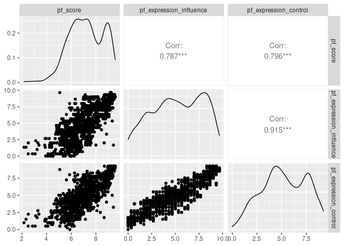

Activity 2 - Day 1
================

## Task2 : Loading the necessary packages

``` r
suppressPackageStartupMessages(library(tidyverse))
suppressPackageStartupMessages(library(tidymodels))
suppressPackageStartupMessages(library(GGally))
suppressPackageStartupMessages(library(scatterplot3d))
```

## Task3 : Loading the data

``` r
hfi<-readr::read_csv("https://www.openintro.org/data/csv/hfi.csv",show_col_types = FALSE)
```

1.  This is an observational study as it was not using or conducting any
    experiment to produce the reports.

## Plot to visualize the distribution of pf\_score

``` r
plot1 <- hfi %>% ggplot(aes(x=pf_score))+
  geom_histogram(fill="dodgerblue",color="black")+
  scale_x_continuous(breaks = c(1,2,3,4,5,6,7,8,9,10))+
  scale_y_continuous(breaks = c(0,20,40,60,80,100))+
  theme_bw()

plot1
```

    ## `stat_bin()` using `bins = 30`. Pick better value with `binwidth`.

    ## Warning: Removed 80 rows containing non-finite values (stat_bin).

<!-- -->

2.  The univariate histogram for pf\_score is left\_skewed with extreme
    outliers on the left (very low pf\_scores) and multiple peaks. I
    expected that a lot of countries will be having low pf\_scores but
    surprisingly it was the opposite.

3.  I have decided to describe the relation between pf\_rol\_civil and
    pf\_rol\_criminal which looks Linear relationship for me and
    displayed below with the help of a scatter plot and linear
    regression line.

``` r
plot2<- hfi %>% ggplot(aes(x=pf_rol_criminal,y=pf_rol_civil))+
  geom_point(color="red")+
  geom_smooth(method = lm)+
  theme_bw()

plot2
```

    ## `geom_smooth()` using formula 'y ~ x'

    ## Warning: Removed 578 rows containing non-finite values (stat_smooth).

    ## Warning: Removed 578 rows containing missing values (geom_point).

<!-- -->

# Task4 : Pairwise relationships

``` r
hfi %>% 
  select(ends_with("_score")) %>% 
  ggpairs()
```

<!-- -->

4.  -   hf\_score and pf\_score - strong Linear relationship
    -   hf\_score and ef\_score - moderate Linear relationship
    -   pf\_score and ef\_score - no relationship (nuetral)

5.  -   hf\_score and pf\_score are highly correlated with
        correlation-coefficient of 0.943
    -   hf\_score and ef\_score are highly correlated with
        correlation-coefficient of 0.855
    -   ef\_score and pf\_score are moderately correlated with
        correlation-coefficient of 0.633

## Task5 : The Multiple Linear Regression Model

``` r
m_hr_ef <- lm(pf_score ~ hf_score + ef_score, data = hfi)
tidy(m_hr_ef)
```

    ## # A tibble: 3 × 5
    ##   term         estimate std.error statistic p.value
    ##   <chr>           <dbl>     <dbl>     <dbl>   <dbl>
    ## 1 (Intercept)  1.46e-11  1.50e-10  9.78e- 2   0.922
    ## 2 hf_score     2.00e+ 0  3.63e-11  5.52e+10   0    
    ## 3 ef_score    -1.00e+ 0  4.21e-11 -2.38e+10   0

6.  The estimated equation for this model is

$$
pf\_score=(1.464213e-11)+ (2.000000e+00)\times hf\_score + (-1.000000e+00)\times ef\_score + \varepsilon
$$

7.  When given the values of hf\_score and ef\_score of a country we can
    substitute those values in the above equation with y-intercept and
    slopes of explanatory variables to predict the nearest pf\_score
    approximately.

## Challenege: 3-D Plots

I have used this
[Reference](http://www.sthda.com/english/wiki/scatterplot3d-3d-graphics-r-software-and-data-visualization)
for 3-D scatterplot visualization

``` r
# Selected only the required columns from the main dataset "hfi" and assigned them to a new dataset "hfi2"

hfi2<-select(hfi,c("pf_score","ef_score","hf_score"))

plot3<-scatterplot3d::scatterplot3d(hfi2[1:100,],main = "3-D Scatterplot",pch = 20,color = "red",grid = FALSE,type ="h",box = FALSE)


# adding a regression plane to the 3-d scatter plot

my.lm <- lm(hfi2$pf_score ~ hfi2$hf_score+ hfi2$ef_score )

plot3$plane3d(my.lm,lty="dashed" ,draw_polygon = TRUE,draw_lines = FALSE)
```

<!-- -->

8.  yes, both the plots (3D-Scatter plot & ggpairs) displayed in github
    when I pushed my work there. When comparing those visualizations I
    found it easy to find the relationships and correlations of the
    variables in ggpairs plot than the 3D-scatter plot and also the
    ggpairs plot provides the correlation coefficient of the variables
    which makes it more easy to take a decision on the relationship of
    variables. Whereas, in 3D-scatter plot it is easy to visualize all
    three variables in the same plot.

# Day 2

## Task 2: Overall model - is at least one predictor useful?

``` r
# review any visual patterns
hfi %>% 
  select(pf_score, pf_expression_influence, pf_expression_control) %>% 
  ggpairs()
```

<!-- -->

``` r
#fit the mlr model
m_pf <- lm(pf_score ~ pf_expression_influence + pf_expression_control, data = hfi)
tidy(m_pf)
```

    ## # A tibble: 3 × 5
    ##   term                    estimate std.error statistic  p.value
    ##   <chr>                      <dbl>     <dbl>     <dbl>    <dbl>
    ## 1 (Intercept)                4.71     0.0566     83.1  0       
    ## 2 pf_expression_influence    0.188    0.0205      9.19 1.44e-19
    ## 3 pf_expression_control      0.288    0.0242     11.9  2.84e-31

1.  The correlation coefficients values (0.787 & 0.796) means that , the
    pf\_expression\_influence is having a 78.7 percent of positive or
    direct relationship with pf\_score whereas the
    pf\_expression\_control is having a 79.6 percent of positive or
    direct relationship with pf\_score.

``` r
summary(m_pf)
```

    ## 
    ## Call:
    ## lm(formula = pf_score ~ pf_expression_influence + pf_expression_control, 
    ##     data = hfi)
    ## 
    ## Residuals:
    ##     Min      1Q  Median      3Q     Max 
    ## -3.9776 -0.5338  0.1493  0.5807  3.4627 
    ## 
    ## Coefficients:
    ##                         Estimate Std. Error t value Pr(>|t|)    
    ## (Intercept)              4.70699    0.05664  83.102   <2e-16 ***
    ## pf_expression_influence  0.18812    0.02048   9.187   <2e-16 ***
    ## pf_expression_control    0.28829    0.02417  11.926   <2e-16 ***
    ## ---
    ## Signif. codes:  0 '***' 0.001 '**' 0.01 '*' 0.05 '.' 0.1 ' ' 1
    ## 
    ## Residual standard error: 0.8077 on 1375 degrees of freedom
    ##   (80 observations deleted due to missingness)
    ## Multiple R-squared:  0.6554, Adjusted R-squared:  0.6549 
    ## F-statistic:  1308 on 2 and 1375 DF,  p-value: < 2.2e-16

2.  We can take a decision to reject the null hypothesis from out
    Hypothesis testing

3.  The decision means that at least one of the explanatory
    variables(pf\_expression\_influence & pf\_expression\_control)will
    be helpful to predict and have a positive relationship with Response
    variable (pf\_score).
